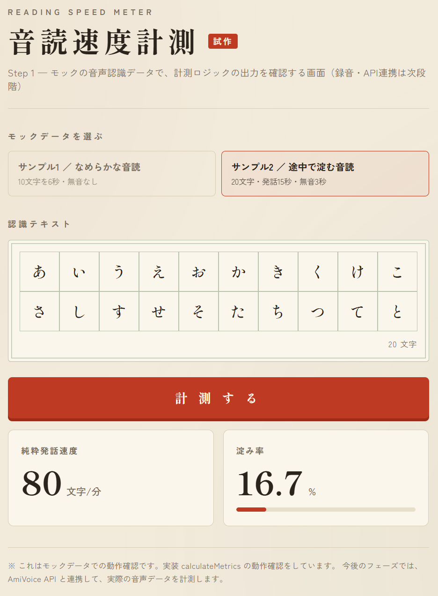
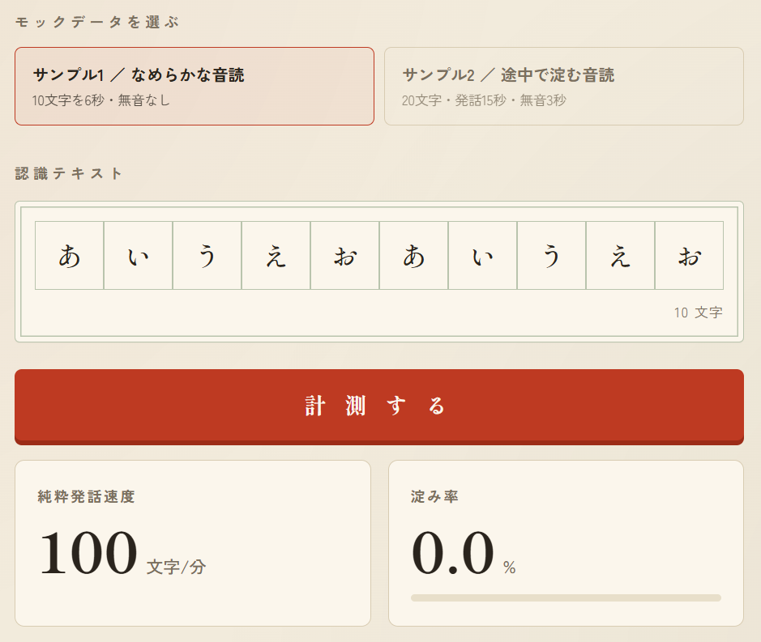
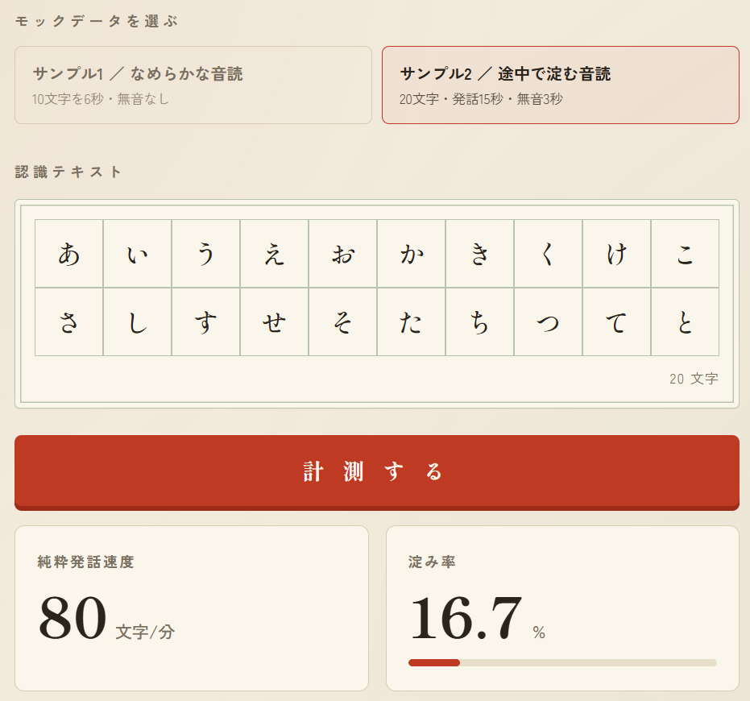

# Reading Speed Meter / 音読速度計測アプリ

日本語テキストを音読し、その速度・流暢性を計測・評価する Web アプリ。  
A web app that measures and evaluates the speed and fluency of Japanese read-aloud.

> 🏆 本プロジェクトは **Zennfes Spring 2026 / AmiVoice 協賛コンテスト** 応募作です。  
> This project is an entry for the **Zennfes Spring 2026 AmiVoice-sponsored contest**.

---

## 📸 Screenshots / 画面イメージ

### モック計測（Step 1）/ Mock metrics (Step 1)

AmiVoice API には未接続。あらかじめ用意した音声認識データ（モック）を選び **「計測する」** を押すと、純粋発話速度と淀み率が表示されます。  
Not connected to AmiVoice yet. Pick a preset mock sample and click **計測する** to see pure speaking speed and stagnation rate.

下図は **サンプル2（途中で淀む音読）** の計測結果（80 字/分・淀み率 16.7%）。  
Below: **Sample 2 (hesitant reading)** — 80 chars/min, 16.7% stagnation.



| サンプル / Sample | 条件 / Condition | 計測結果 / Result |
|---|---|---|
| サンプル1（なめらか） / Sample 1 (smooth) | 10 文字・6 秒・無音なし | 100 字/分・淀み率 0% |
| サンプル2（淀む） / Sample 2 (hesitant) | 20 文字・発話 15 秒・無音 3 秒 | 80 字/分・淀み率 16.7% |

<p align="center">
  
  
</p>

### ブラウザ録音（Step 2）/ Browser recording (Step 2)

マイクで音読を録音し、その場で再生して確認できます（最大 10 秒）。録音形式（mimeType）と Blob 情報を画面に表示します。AmiVoice への送信は Step 3 以降。  
Record read-aloud via microphone, play back on the spot (max 10 seconds). Shows mimeType and Blob info. Sending to AmiVoice is planned for Step 3.

| 機能 / Feature | 説明 / Description |
|---|---|
| 録音開始・停止 / Start & stop | `MediaRecorder` + `getUserMedia` |
| 自動停止 / Auto-stop | 10 秒経過で録音終了 / Stops after 10 seconds |
| 再生確認 / Playback | `<audio controls>` で録音内容を確認 |
| 形式確認 / Format info | 選択 mimeType・Blob type・サイズを表示 |

---

## 🚀 Getting Started / セットアップ

```bash
npm install   # 初回のみ / first time only
npm run dev   # 開発サーバー → http://localhost:3000
npm test      # Vitest（単体テスト / unit tests）
npm run build # 本番ビルド確認 / production build check
```

### 動作確認の手順 / How to try it

1. `http://localhost:3000` を開く / Open in browser
2. **モック計測:** サンプルを選び「計測する」を押す / Pick a mock sample → **計測する**
3. **録音:** 「録音開始」→ 音読 →「録音停止」（または 10 秒待機）/ **録音開始** → read aloud → **録音停止** (or wait 10s)
4. 再生プレーヤーで録音を確認 / Confirm recording with the audio player

> 録音にはマイク許可が必要です。HTTPS または `localhost` で動作します。  
> Recording requires microphone permission. Works on HTTPS or `localhost`.

---

## 📁 Project Structure / プロジェクト構成

```
reading-speed-meter/
├── app/
│   ├── layout.tsx                  # 共通レイアウト / root layout
│   └── page.tsx                    # UI + モック計測 + ブラウザ録音（Client Component）
├── lib/metrics/
│   ├── types.ts                    # 型定義 / type definitions
│   ├── calculateMetrics.ts         # 指標算出の純粋関数 / pure function
│   ├── calculateMetrics.test.ts    # Vitest（6 tests）
│   └── mockData.ts                 # モック AmiVoice データ / mock data
├── docs/screenshots/               # README 用キャプチャ / screenshots
├── README.md
├── LEARNING_LOG_Phase1.md          # Step 1 開発記録 / Step 1 dev log
└── LEARNING_LOG_Phase2.md          # Step 2 開発記録 / Step 2 dev log
```

---

## 🤖 Development Style / 開発スタイル

締切があるため、**AI 協業開発** を採用しています（透明に開示）。  
Due to the deadline, this project uses **AI collaborative development** (disclosed openly).

| 日本語 | English |
|---|---|
| 設計・技術選定・仕様の判断は自分 | Design, tech selection, and spec decisions are mine |
| AI の提案を取捨選択・検証・修正したのは自分 | I select, verify, and revise AI suggestions |
| コードの動作を理解している | I understand how the code works |

| フェーズ / Phase | 進め方 / Approach |
|---|---|
| Step 1 | ヒント中心。コードは自分で書き、AI はレビュー役 |
| Step 2 以降 | MediaRecorder 等の定型は AI が例示、概念の核（状態設計など）は自分で実装 |

詳細な振り返り / Detailed logs:

- [`LEARNING_LOG_Phase1.md`](./LEARNING_LOG_Phase1.md) — 純粋関数・Vitest・モック UI
- [`LEARNING_LOG_Phase2.md`](./LEARNING_LOG_Phase2.md) — ブラウザ録音（MediaRecorder）

---

## 🛠 Tech Stack / 技術構成

| レイヤー / Layer | 採用技術 / Technology | 備考 / Notes |
| :--- | :--- | :--- |
| フレームワーク / Framework | Next.js 16 (App Router) | API Routes は Step 3 以降 |
| 言語 / Language | TypeScript | |
| ブラウザ録音 / Recording | MediaRecorder API | Step 2 で実装済み |
| 音声認識 / Speech-to-Text | AmiVoice API | Step 3 以降（予定） |
| AI フィードバック / AI Feedback | Claude API (Haiku) | Step 3 以降（予定） |
| テスト / Testing | Vitest | `npm test`（6 tests） |
| デプロイ / Deploy | Vercel | Step 3 以降（予定） |

---

## 🏗 Architecture / アーキテクチャ

### 現在地（Step 2 完了）/ Current state (Step 2 done)

```
[ブラウザ Browser]
  ├─ モック計測: mockData → calculateMetrics → 結果表示
  │   Mock metrics: mockData → calculateMetrics → display
  └─ 録音: getUserMedia → MediaRecorder → Blob → 再生確認
      Recording: getUserMedia → MediaRecorder → Blob → playback
```

### 今後（Step 3 以降）/ Planned (Step 3+)

AmiVoice / Claude の API キーは **絶対にブラウザに出さない**。Next.js API Routes が BFF（中継）を担う。  
API keys for AmiVoice / Claude are **never exposed to the browser**. Next.js API Routes will act as a BFF proxy.

```
[ブラウザ Browser] ──音声 Blob──▶ [API Routes (BFF)] ──▶ [AmiVoice API]（音声→テキスト）
 録音・計測・表示              キーを保持 hold keys    ──▶ [Claude Haiku]（一言フィードバック）
```

---

## ✅ Progress / 進捗

### Phase 1 — Step 1（完了 / Done）

評価指標の純粋関数・単体テスト・モック UI。  
Pure metric function, unit tests, and mock UI.

- [x] `segments` から指標を算出する **純粋関数**（`lib/metrics/calculateMetrics.ts`）
- [x] **Vitest 単体テスト**（6 本・異常系・正常系・境界値）
- [x] モックデータでの **UI 動作確認**（認識テキスト表示 + 計測ボタン + 結果表示）

### Phase 1 — Step 2（完了 / Done）

ブラウザでの音声録音（MediaRecorder）。AmiVoice / Claude API には未接続。  
Browser audio recording via MediaRecorder. Not connected to AmiVoice / Claude yet.

- [x] マイク許可の取得と録音の開始・停止（最大 10 秒）
- [x] 録音結果を **Blob** として取得
- [x] **再生確認** UI（`<audio controls>`）
- [x] 録音状態（待機 / 録音中 / 完了 / エラー）を `useState` で管理・画面反映
- [x] mimeType フォールバック（`isTypeSupported`）と Blob 情報の画面表示
- [x] 既存のモック計測 UI を維持したまま録音機能を追加

### Phase 1 — Step 3 以降（予定 / Planned）

- [ ] API Routes 経由で AmiVoice 連携（録音 Blob を送信）
- [ ] 認識結果を `calculateMetrics` に接続（モック → 実データ）
- [ ] Claude Haiku で一言フィードバック生成
- [ ] Vercel デプロイ + 環境変数（`AMIVOICE_API_KEY` / `ANTHROPIC_API_KEY`）

---

## 📐 Metrics Spec / 指標仕様

### 入力・出力 / Input & Output

```typescript
// 入力 / Input（AmiVoice レスポンスの一部を詰め替えた型）
interface AmiVoiceSegment {
  starttime: number; // ミリ秒 / ms
  endtime: number;   // ミリ秒 / ms
}
interface AmiVoiceResponse {
  text: string;
  segments: AmiVoiceSegment[]; // 各発話区間 / per-utterance segments
}

// 出力 / Output
interface ReadingMetrics {
  pureSpeakingSpeed: number; // 純粋発話速度（文字/分）/ chars per minute
  stagnationRate: number;    // 淀み率（0〜1）/ stagnation ratio (0–1)
}

function calculateMetrics(response: AmiVoiceResponse): ReadingMetrics
```

### 算出ロジック / Calculation

| 指標 / Metric | 式 / Formula |
|---|---|
| 純粋発話時間 / pure speaking time | `totalSpeakingTimeMs` = Σ(endtime − starttime) |
| 総経過時間 / total elapsed time | `totalElapsedTimeMs` = 最後の endtime − 最初の starttime |
| 純粋発話速度 / pure speaking speed | 文字数 ÷ 純粋発話時間(分)、`Math.round` で整数化 |
| 淀み率 / stagnation rate | (総経過時間 − 純粋発話時間) ÷ 総経過時間、小数第 3 位まで |

- **文字数 / character count:** 認識テキスト基準・コードポイント単位 `[...text].length`

### 異常系・境界値ガード / Guards

| 条件 / Condition | 戻り値 / Return |
|---|---|
| `segments` が空 / `text` が空 | `{ pureSpeakingSpeed: 0, stagnationRate: 0 }` |
| 純粋発話時間 0ms / 総経過時間 0ms | ゼロ除算を防ぎ 0 |
| 純粋発話時間 0 かつ総経過時間 > 0 | 発話なしとして `{ 0, 0 }` |

---

## ⚖️ Design Decisions / 仕様判断

### 指標（Step 1）/ Metrics (Step 1)

| 項目 / Topic | 決定内容 / Decision |
|---|---|
| 指標名 / metric name | `stagnationRate`（淀み率）。`silenceRate` は見送り |
| 文字数 / character count | 認識テキスト基準（元テキスト基準は飛ばし読みで過大評価のため見送り） |
| マッパー / mapper | 生 AmiVoice レスポンス → `AmiVoiceResponse` は純粋関数の外に 1 枚 |
| テスト配置 / test location | `lib/metrics/` 直下（co-locate） |

### 録音（Step 2）/ Recording (Step 2)

| 項目 / Topic | 決定内容 / Decision |
|---|---|
| 録音形式 / mimeType | `isTypeSupported` で候補を順に試す（Chrome: webm/opus、Safari: mp4 等） |
| 録音状態 / recording phase | Enum: 待機 / 録音中 / 完了 / エラー（一時停止なし） |
| 録音時間 / duration | 最大 10 秒（手動停止 or 自動停止） |
| エラー表示 / error UX | フェーズに `Error` + `errorMessage` を別 state |
| 再録音失敗時 / re-record failure | 前回成功した Blob を温存（フォールバック用） |
| 再生 UI 表示 / player visibility | 待機中・録音中は非表示。完了 or エラー（前回録音あり）時に表示 |

---

## 🧪 Tests / テスト

`npm test` で 6 本実行（すべて PASS）。録音機能はブラウザ手動確認。  
`npm test` runs 6 tests (all PASS). Recording is verified manually in the browser.

| カテゴリ / Category | 内容 / Case |
|---|---|
| 異常系 / error | `segments: []`、`text: ""`、両方空 → `{ 0, 0 }` |
| 境界 / boundary | ゼロ幅区間 → 速度 0、割り算が壊れない |
| 正常系 / normal | 1 区間・無音なし → 100 字/分、淀み率 0 |
| 無音あり / with pause | 2 区間・無音 3 秒 → 80 字/分、淀み率 0.167 |

---

## 🖥 UI / 画面構成

画面の見た目は Claude たたき台をベースに、計測ロジックは `lib/metrics/`、録音は `page.tsx` 内の MediaRecorder 処理に接続。  
UI layout from a Claude mockup; metrics in `lib/metrics/`; recording via MediaRecorder in `page.tsx`.

| 要素 / Element | 役割 / Role |
|---|---|
| サンプル切替タブ / sample tabs | モック 2 パターンを選択 / pick mock preset |
| 原稿用紙グリッド / manuscript grid | 認識テキストを 1 文字ずつ表示 / one char per cell |
| 録音ボタン / record buttons | 開始・停止・再録音（状態に応じて切替）/ start, stop, re-record |
| 録音状態表示 / recording status | 待機 / 録音中 / 完了 / エラー / idle / recording / done / error |
| 再生プレーヤー / audio player | 録音 Blob の再生確認 / playback confirmation |
| 録音情報 / recording info | mimeType・Blob type・サイズ / format and size |
| 計測するボタン / measure button | `calculateMetrics()` を実行（現状はモックデータ） |
| 結果カード / result cards | 純粋発話速度・淀み率（%）/ speed and stagnation |

---

## 🗺 Roadmap / ロードマップ

**Phase 1（積み上げ式 / incremental）**

1. ✅ 純粋関数 + Vitest + モック UI
2. ✅ ブラウザ録音（MediaRecorder）
3. API Routes 経由で AmiVoice 連携
4. Claude Haiku で一言フィードバック生成
5. Vercel デプロイ + 環境変数

**Phase 2 以降 / Later**

編集距離による正確性、テンポ安定性、抑揚（感情解析）、履歴表示、UI 磨き込み、`page.tsx` の録音ロジック分離。  
Accuracy via edit distance, tempo stability, prosody, history, UI polish, and extracting recording logic from `page.tsx`.

---

## 🔗 Links / リンク

- リポジトリ / Repository: [github.com/uya0526-design/reading-speed-meter](https://github.com/uya0526-design/reading-speed-meter)
