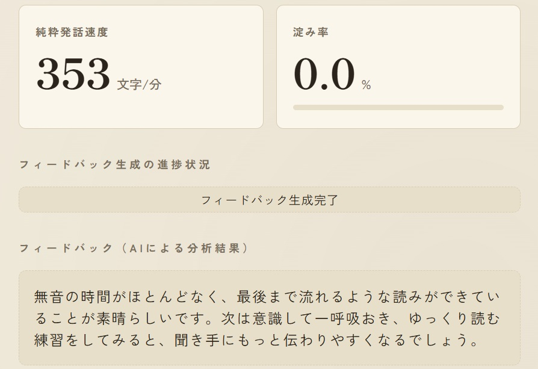
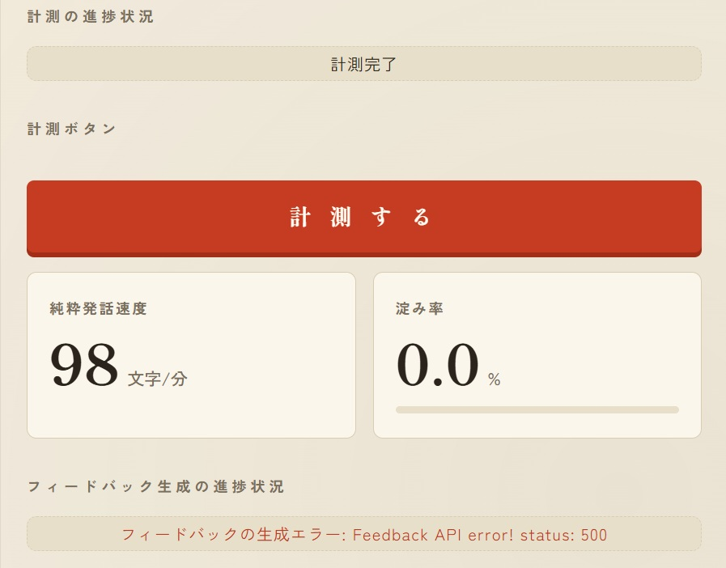

# Reading Speed Meter / 音読速度計測アプリ

日本語テキストを音読し、AmiVoice で音声認識した結果から速度・流暢性を計測し、Claude Haiku による一言フィードバックを返す Web アプリ。  
A web app that measures read-aloud speed and fluency via AmiVoice speech recognition, then returns a short coaching message from Claude Haiku.

> 🏆 本プロジェクトは **Zennfes Spring 2026 / AmiVoice 協賛コンテスト** 応募作です。  
> This project is an entry for the **Zennfes Spring 2026 AmiVoice-sponsored contest**.

**Phase 1 機能開発完了** — 録音 → AmiVoice 計測 → AI フィードバックまで実装済み（デプロイは Step 5 予定）。  
**Phase 1 feature-complete** — record → AmiVoice metrics → AI feedback (deploy planned in Step 5).

---

## 📸 Screenshots / 画面イメージ

以下は **Phase 1 機能開発完了** 時点の UI キャプチャ（古典抜粋原稿・指標・AI フィードバック）。  
All captures reflect the **Phase 1 feature-complete** UI (classical excerpts, metrics, AI feedback).

### アプリ全体 / App overview

読み上げ原稿 → 録音（最大 10 秒）→ 計測 → 指標 → AI フィードバック、までの一連の流れ。  
Manuscript → record (max 10 s) → measure → metrics → AI feedback.


### 読み上げ原稿 / Read-aloud manuscripts

原稿用紙（10 列グリッド）に読むテキストを表示。**表示専用** — 計測は録音 Blob のみがデータ源（原稿との照合は Phase 2 予定）。  
Manuscript grid for display only; measurement uses the recorded Blob (manuscript comparison planned for Phase 2).

| サンプル / Sample | 出典 / Source | 備考 / Notes |
|---|---|---|
| サンプル1 / Sample 1 | 平家物語（冒頭抜粋）/ *Heike Monogatari* | （伝）信濃前司行長 |
| サンプル2 / Sample 2 | 方丈記（冒頭抜粋）/ *Hōjōki* | 鴨長明 |

<p align="center">
  
  
</p>

### ブラウザ録音 / Browser recording

| 機能 / Feature | 説明 / Description |
|---|---|
| 録音開始・停止 / Start & stop | `useRecorder` + `MediaRecorder` + `getUserMedia` |
| 自動停止 / Auto-stop | 10 秒経過で録音終了 / Stops after 10 seconds |
| 再生確認 / Playback | `<audio controls>` で録音内容を確認 |
| 形式確認 / Format info | 選択 mimeType・Blob type・サイズを表示 |

#### 録音待機 / Idle


#### 録音中 / Recording


#### 録音完了 / Done


#### 録音エラー / Error

マイク拒否などで録音に失敗した状態。  
Recording failed (e.g. microphone permission denied).


#### 再録音失敗時のフォールバック / Re-record failure fallback

1 回目の録音は成功済み。2 回目が失敗しても **前回の録音を再生可能**。  
First recording succeeded; previous recording remains playable after a failed re-record.


### 計測結果・AI フィードバック / Metrics & AI feedback

| 機能 / Feature | 説明 / Description |
|---|---|
| AmiVoice BFF | `POST /api/recognize` — 生 JSON → `calculateMetrics` |
| ラベル化 / Labeling | `labelMetrics` — 速度・淀み率をコード側で評価ラベルに変換 |
| Claude BFF | `POST /api/feedback` — Haiku へ `FeedbackFacts` を渡し一言生成 |
| 計測状態 / Measure status | 未計測 / 計測中 / 計測完了 / 計測エラー |
| フィードバック状態 / Feedback status | 生成中 / 生成完了 / 生成エラー |

#### 計測・フィードバック成功 / Success

指標カード（純粋発話速度・淀み率）と AI コーチング文。  
Metric cards and AI coaching text.



#### フィードバックのみ失敗（指標は表示）/ Feedback failure (metrics retained)

計測は成功、`ANTHROPIC_API_KEY` 欠落等でフィードバックだけ 500。**F1:** 指標はそのまま表示。  
Measurement succeeded; feedback failed (e.g. missing API key). Metrics remain visible (F1).



---

## 🚀 Getting Started / セットアップ

### 1. 依存関係 / Dependencies

```bash
npm install   # 初回のみ / first time only
```

### 2. 環境変数 / Environment variables

プロジェクトルートに `.env.local` を作成（Git には含めない）。  
Create `.env.local` at the project root (not committed to Git).

```env
AMIVOICE_API_KEY=your_amivoice_api_key
ANTHROPIC_API_KEY=your_anthropic_api_key
ANTHROPIC_MODEL=claude-haiku-4-5
```

| 変数 / Variable | 用途 / Purpose |
|---|---|
| `AMIVOICE_API_KEY` | AmiVoice 同期 HTTP API（[マイページ](https://docs.amivoice.com/)から取得） |
| `ANTHROPIC_API_KEY` | Claude Messages API（[Anthropic Console](https://console.anthropic.com/)） |
| `ANTHROPIC_MODEL` | 使用モデル ID（例: `claude-haiku-4-5`） |

> API キーは **サーバー側 Route のみ**（`app/api/recognize`、`app/api/feedback`）。ブラウザには絶対に出しません。  
> Keys stay **server-side only** in API Routes, never exposed to the browser.

### 3. 開発サーバー / Dev server

```bash
npm run dev    # → http://localhost:3000
npm test       # Vitest（28 tests）
npm run build  # 本番ビルド確認 / production build check
```

### 動作確認の手順 / How to try it

1. `http://localhost:3000` を開く / Open in browser
2. **読み上げ原稿を選ぶ** / Pick a manuscript tab
3. **録音** / Record: **録音開始** → 音読 → **録音停止**（または 10 秒待機 / or wait 10s）
4. 再生プレーヤーで録音を確認 / Confirm with the audio player
5. **計測する** / Click **計測する** — AmiVoice で認識し、純粋発話速度・淀み率を表示 / recognition → metrics
6. 続けて **Claude Haiku が一言フィードバック** を生成・表示 / short AI coaching message appears

> 録音にはマイク許可が必要です。HTTPS または `localhost` で動作します。  
> Recording requires microphone permission. Works on HTTPS or `localhost`.

> **MVP の限界 / MVP limits:** 原稿と認識テキストの照合・正確性指標は未実装。淀み率は日本語の「間」を区別しません。  
> No manuscript-vs-recognition accuracy yet; stagnation rate does not distinguish intentional pauses.

### API Route 単体確認（任意）/ Optional API Route tests

**AmiVoice 中継 / AmiVoice proxy**

```bash
curl.exe -X POST http://localhost:3000/api/recognize -F "audio=@recording.webm"
```

**Claude フィードバック / Claude feedback**

```bash
curl.exe -X POST http://localhost:3000/api/feedback ^
  -H "Content-Type: application/json" ^
  -d "{\"pureSpeakingSpeed\":80,\"pureSpeakingSpeedEvaluation\":\"遅い\",\"stagnationRate\":16.7,\"stagnationRateEvaluation\":\"やや多い\"}"
```

---

## 📁 Project Structure / プロジェクト構成

```
reading-speed-meter/
├── app/
│   ├── api/
│   │   ├── recognize/route.ts      # AmiVoice BFF（同期 HTTP 中継）
│   │   └── feedback/route.ts       # Claude Haiku BFF
│   ├── layout.tsx
│   └── page.tsx                    # UI + 録音 + 計測 + フィードバック
├── lib/
│   ├── feedback/
│   │   ├── types.ts                # FeedbackFacts, FeedbackPhase
│   │   └── prompt.ts               # 静的 system プロンプト
│   ├── metrics/
│   │   ├── types.ts                # AnalysisPhase 等
│   │   ├── calculateMetrics.ts
│   │   ├── calculateMetrics.test.ts
│   │   ├── mapAmiVoiceResponse.ts
│   │   ├── mapAmiVoiceResponse.test.ts
│   │   ├── thresholds.ts           # 速度・淀み率の境界値
│   │   ├── labelMetrics.ts         # 指標 → 評価ラベル
│   │   ├── labelMetrics.test.ts
│   │   └── mockData.ts             # 読み上げ原稿（表示専用）
│   └── recorder/
│       ├── types.ts                # RecordingPhase
│       ├── constants.ts
│       ├── mimeType.ts
│       ├── mimeType.test.ts
│       └── useRecorder.ts
├── fixtures/                       # AmiVoice レスポンス fixture（Vitest）
├── docs/screenshots/               # README 用キャプチャ（10 枚 / 10 images）
├── LEARNING_LOG_Phase1_Step1.md
├── LEARNING_LOG_Phase1_Step2.md
├── LEARNING_LOG_Phase1_Step3.md
├── LEARNING_LOG_Phase1_Step4.md
└── README.md
```

---

## 🤖 Development Style / 開発スタイル

締切があるため、**AI 協業開発** を採用しています（透明に開示）。  
Due to the deadline, this project uses **AI collaborative development** (disclosed openly).

| 日本語 | English |
|---|---|
| 設計・技術選定・仕様の判断は自分 | Design, tech selection, and spec decisions are mine |
| AI の提案を取捨選択・検証・修正したのは自分 | I select, verify, and revise AI suggestions |
| コードの動作を理解している | I understand how the code works |
| ドメイン知識は自分で裏取りする | I verify domain facts (e.g. citations, UX) myself |

| フェーズ / Phase | 進め方 / Approach |
|---|---|
| Step 1 | ヒント中心。コードは自分で書き、AI はレビュー役 |
| Step 2 以降 | 定型（MediaRecorder、fetch、API Route 骨子）は AI が例示 + 1 行解説。状態設計・データフローは自分で実装 |

詳細な振り返り / Detailed logs:

- [`LEARNING_LOG_Phase1_Step1.md`](./LEARNING_LOG_Phase1_Step1.md) — 純粋関数・Vitest・モック UI
- [`LEARNING_LOG_Phase1_Step2.md`](./LEARNING_LOG_Phase1_Step2.md) — ブラウザ録音（MediaRecorder）
- [`LEARNING_LOG_Phase1_Step3.md`](./LEARNING_LOG_Phase1_Step3.md) — AmiVoice 連携・BFF・マッパー・実データ計測
- [`LEARNING_LOG_Phase1_Step4.md`](./LEARNING_LOG_Phase1_Step4.md) — ラベル化・Claude Haiku フィードバック

---

## 🛠 Tech Stack / 技術構成

| レイヤー / Layer | 採用技術 / Technology | 備考 / Notes |
| :--- | :--- | :--- |
| フレームワーク / Framework | Next.js 16 (App Router) | API Routes（BFF）× 2 |
| 言語 / Language | TypeScript | |
| ブラウザ録音 / Recording | MediaRecorder API | `lib/recorder/useRecorder` |
| 音声認識 / Speech-to-Text | AmiVoice API（同期 HTTP） | `POST /api/recognize` |
| AI フィードバック / AI Feedback | Claude API (Haiku) | `POST /api/feedback`、`@anthropic-ai/sdk` |
| テスト / Testing | Vitest | `npm test`（28 tests） |
| デプロイ / Deploy | Vercel | Step 5 予定 / planned |

---

## 🏗 Architecture / アーキテクチャ

**設計の背骨:** 計算・しきい値・ラベル化はコード側で確定。Haiku には整理済みの事実（`FeedbackFacts`）だけを渡す。  
**Core principle:** metrics and labels are computed in code; Haiku receives pre-labeled facts only.

AmiVoice / Claude の API キーは **絶対にブラウザに出さない**。Next.js API Routes が BFF を担う。  
API keys are **never exposed to the browser**. Next.js API Routes act as a BFF proxy.

```
[ブラウザ Browser]
  ├─ 原稿表示: mockData（読み上げテキスト・表示専用）
  │   Manuscript display (display only)
  ├─ 録音: getUserMedia → MediaRecorder → Blob
  │   Recording → Blob
  └─ 計測:
       FormData(audio) → POST /api/recognize
            ↓
       mapAmiVoiceResponse → calculateMetrics → 指標表示
            ↓
       labelMetrics → FeedbackFacts
            ↓
       POST /api/feedback → feedback 表示

[API Routes / BFF]
  /api/recognize … AMIVOICE_API_KEY → AmiVoice 同期 HTTP
  /api/feedback  … ANTHROPIC_* → Claude Messages API
                   system: FEEDBACK_PROMPT（cache_control: ephemeral）
```

### AmiVoice 中継の要点 / AmiVoice proxy essentials

| 項目 / Item | 内容 / Detail |
|---|---|
| エンドポイント / Endpoint | `https://acp-api.amivoice.com/v1/nolog/recognize` |
| 認証 / Auth | multipart `u` = API キー（`Authorization` ヘッダではない） |
| エンジン / Engine | `d` = `-a-general`（会話_汎用） |
| 音声 / Audio | `a` = webm Blob（**multipart の最終パート**） |
| WebM + Opus | ヘッダあり → `c` パラメータ省略可 |

### Claude フィードバックの要点 / Claude feedback essentials

| 項目 / Item | 内容 / Detail |
|---|---|
| 入力 / Input | `FeedbackFacts` JSON（速度・速度評価・淀み率・淀み率評価） |
| system | 静的 `FEEDBACK_PROMPT` + `cache_control: ephemeral` |
| 出力 / Output | `{ feedback: "..." }` — 2 文・敬体・温かい口調 |
| エラー分離 / Error isolation | 計測成功 + フィードバック失敗時も指標は表示（`FeedbackPhase.Error`） |

---

## ✅ Progress / 進捗

### Phase 1 — Step 1（完了 / Done）

- [x] `segments` から指標を算出する **純粋関数**（`calculateMetrics.ts`）
- [x] **Vitest 単体テスト**（異常系・正常系・境界値）
- [x] モック原稿での **UI 動作確認**

### Phase 1 — Step 2（完了 / Done）

- [x] マイク許可・録音開始・停止（最大 10 秒）
- [x] 録音結果を **Blob** として取得・再生確認
- [x] 録音状態（`RecordingPhase`）の管理・画面反映
- [x] mimeType フォールバック（`isTypeSupported`）と Blob 情報表示

### Phase 1 — Step 3（完了 / Done）

- [x] 録音ロジックを `lib/recorder/` に分離（`useRecorder`）
- [x] **API Routes** 経由の AmiVoice 同期 HTTP 中継（BFF）
- [x] 生 JSON → `AmiVoiceResponse` **マッパー** + Vitest
- [x] 録音 Blob → 認識 → `calculateMetrics` → 結果表示
- [x] 計測状態（`AnalysisPhase`）の UI 表示

### Phase 1 — Step 4（完了 / Done）

- [x] しきい値 → ラベル変換（`thresholds.ts` + `labelMetrics.ts`）+ Vitest 13 本
- [x] **`POST /api/feedback`** — Claude Haiku BFF
- [x] 計測成功後のフィードバック配線（`labelMetrics` → fetch → 表示）
- [x] **`FeedbackPhase`** — 生成中 / 完了 / エラー（計測との失敗分離）
- [x] 読み上げ原稿の古典抜粋化、Phase 1 完了 UI

### Phase 1 — Step 5（予定 / Planned）

- [ ] Vercel デプロイ + 環境変数（`AMIVOICE_API_KEY` / `ANTHROPIC_*`）

### Phase 2 以降（予定 / Planned）

- [ ] 編集距離による **正確性**、原稿と認識テキストの照合 UX
- [ ] 認識テキストの画面表示、テンポ安定性、履歴、UI 磨き込み

---

## 📐 Metrics Spec / 指標仕様

### 入力・出力 / Input & Output

```typescript
interface ReadingMetrics {
  pureSpeakingSpeed: number; // 純粋発話速度（字/分）/ chars per minute
  stagnationRate: number;    // 淀み率（0〜1）/ stagnation ratio (0–1)
}

interface FeedbackFacts {
  pureSpeakingSpeed: number;
  pureSpeakingSpeedEvaluation: string; // 遅い / やや遅い / 標準 / やや速い / 速い
  stagnationRate: number;              // パーセント表示用 / percent for display
  stagnationRateEvaluation: string;    // 少ない / やや少ない / 普通 / やや多い / 多い
}
```

### 算出ロジック / Calculation（`calculateMetrics`）

| 指標 / Metric | 式 / Formula |
|---|---|
| 純粋発話時間 / pure speaking time | Σ(endtime − starttime) |
| 総経過時間 / total elapsed time | 最後の endtime − 最初の starttime |
| 純粋発話速度 / pure speaking speed | 文字数 ÷ 純粋発話時間(分)、`Math.round` |
| 淀み率 / stagnation rate | (総経過時間 − 純粋発話時間) ÷ 総経過時間、小数第 3 位 |

- **文字数 / character count:** 認識テキスト基準・コードポイント単位 `[...text].length`

### 評価ラベル / Evaluation labels（`labelMetrics`）

| 軸 / Axis | ラベル / Labels | 境界（字/分 or %）/ Thresholds |
|---|---|---|
| 速度 / Speed | 遅い → 速い | <150 / 150–199 / 200–299 / 300–350 / >350 |
| 速度の基準 / Speed reference | アナウンサー 300 字/分を「やや速い」下限に / announcer ~300 cpm | |
| 淀み率 / Stagnation | 少ない → 多い | 0% / 1–5% / 6–10% / 11–20% / >20% |

---

## ⚖️ Design Decisions / 仕様判断

### 指標（Step 1）/ Metrics (Step 1)

| 項目 / Topic | 決定内容 / Decision |
|---|---|
| 指標名 / metric name | `stagnationRate`（淀み率） |
| 文字数 / character count | 認識テキスト基準（コードポイント） |
| マッパー / mapper | 生 AmiVoice JSON → `AmiVoiceResponse` は純粋関数 1 枚 |

### 録音（Step 2）/ Recording (Step 2)

| 項目 / Topic | 決定内容 / Decision |
|---|---|
| 録音形式 / mimeType | `isTypeSupported` で候補を順に試す |
| 録音状態 / phase | `RecordingPhase` enum |
| 録音時間 / duration | 最大 10 秒 |
| 再録音失敗時 / re-record failure | 前回成功 Blob を温存 |
| 再録音開始時 / re-record start | 計測・フィードバック state を Idle にリセット（`handleRecordingStartClick`） |

### AmiVoice・計測（Step 3）/ AmiVoice & measurement (Step 3)

| 項目 / Topic | 決定内容 / Decision |
|---|---|
| API キー / API key | `.env.local` → サーバー Route のみ |
| 中継形式 / proxy | 同期 HTTP、`u` / `d` / `a` multipart |
| segments | 各 token の start/end を segment に |
| 計測状態 / measure phase | `AnalysisPhase` を録音と別 enum |
| 原稿タブ / manuscript tabs | 読み上げ表示用。計測データ源は録音 Blob |

### AI フィードバック（Step 4）/ AI feedback (Step 4)

| 項目 / Topic | 決定内容 / Decision |
|---|---|
| ルート / routes | `/api/feedback` 新設（`/api/recognize` は非変更） |
| ラベル化 / labeling | `thresholds.ts` + `labelMetrics.ts`（Vitest で境界値検証） |
| Haiku 入力 / LLM input | `FeedbackFacts` のみ（原稿・segments は渡さない） |
| 正確性 / accuracy | Phase 2 まで送らない（MVP） |
| プロンプト / prompt | 静的 system、100 字は努力目標 |
| エラー UX / error UX | `FeedbackPhase` 独立。計測成功 + フィードバック失敗を分離 |

---

## 🧪 Tests / テスト

`npm test` で **28 本**実行（すべて PASS）。録音・API 連携はブラウザ / curl で手動確認。  
`npm test` runs **28 tests** (all PASS). Recording and API flows are verified manually.

| ファイル / File | 本数 / Count | 内容 / Coverage |
|---|---|---|
| `calculateMetrics.test.ts` | 6 | 異常系・境界・正常系・無音あり |
| `mimeType.test.ts` | 7 | 純粋関数・フォールバック・ブラウザラッパー |
| `mapAmiVoiceResponse.test.ts` | 2 | curl 実データ fixture + 具体値 assert |
| `labelMetrics.test.ts` | 13 | 速度・淀み率の境界値・評価ラベル |

---

## 🖥 UI / 画面構成

和風 UI。計測は `lib/metrics/`、録音は `lib/recorder/`、フィードバック準備は `lib/feedback/`。  
Japanese-style UI. Metrics in `lib/metrics/`; recording in `lib/recorder/`; feedback in `lib/feedback/`.

| 要素 / Element | 役割 / Role |
|---|---|
| 原稿タブ / manuscript tabs | 平家物語・方丈記の抜粋を選択 |
| 原稿用紙グリッド / manuscript grid | 1 文字ずつ表示 |
| 録音ボタン / record buttons | 開始・停止・再録音（再録音時に計測エラー表示をクリア） |
| 録音状態 / recording status | 待機 / 録音中 / 完了 / エラー |
| 再生プレーヤー / audio player | 録音 Blob の再生確認 |
| 計測状態 / measure status | 未計測 / 計測中 / 計測完了 / 計測エラー |
| 計測する / measure button | 録音 → AmiVoice → 指標算出 |
| 結果カード / result cards | 純粋発話速度・淀み率（%） |
| フィードバック進捗 / feedback status | 生成中 / 完了 / エラー |
| フィードバック本文 / feedback body | Claude Haiku の 2 文コーチング |

---

## 🗺 Roadmap / ロードマップ

**Phase 1（積み上げ式 / incremental）**

1. ✅ 純粋関数 + Vitest + モック UI
2. ✅ ブラウザ録音（MediaRecorder）
3. ✅ API Routes 経由で AmiVoice 連携 + 実データ計測
4. ✅ Claude Haiku で一言フィードバック生成
5. ⬜ Vercel デプロイ + 環境変数

**Phase 2 以降 / Later**

編集距離による正確性、認識テキスト表示、原稿との比較 UX、テンポ安定性、履歴、UI 磨き込み。  
Accuracy via edit distance, recognized text display, manuscript comparison, tempo stability, history, UI polish.

---

## 🔗 Links / リンク

- リポジトリ / Repository: [github.com/uya0526-design/reading-speed-meter](https://github.com/uya0526-design/reading-speed-meter)
- AmiVoice API マニュアル / AmiVoice docs: [docs.amivoice.com](https://docs.amivoice.com/amivoice-api/manual/sync-http-interface)
- Anthropic API / Anthropic docs: [docs.anthropic.com](https://docs.anthropic.com/)
