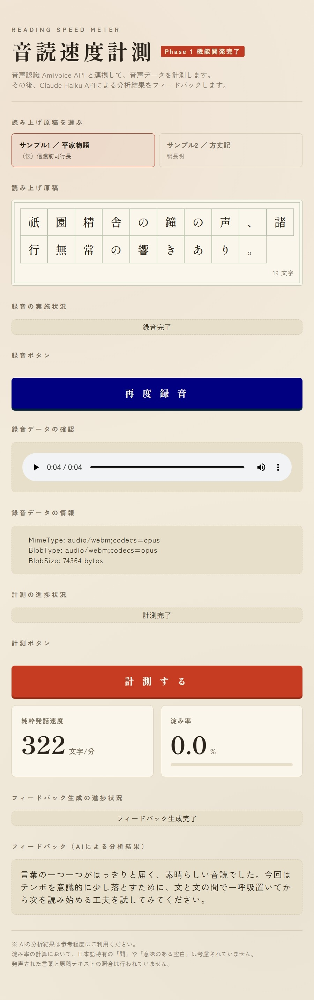
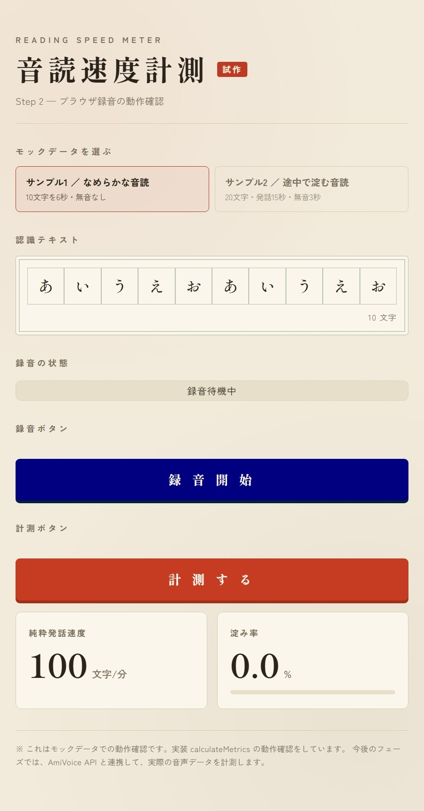
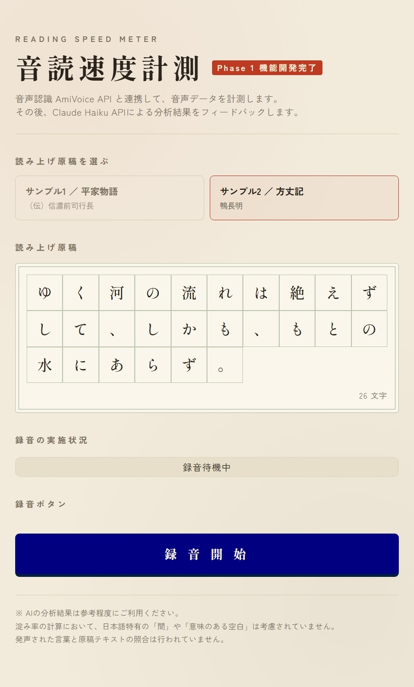
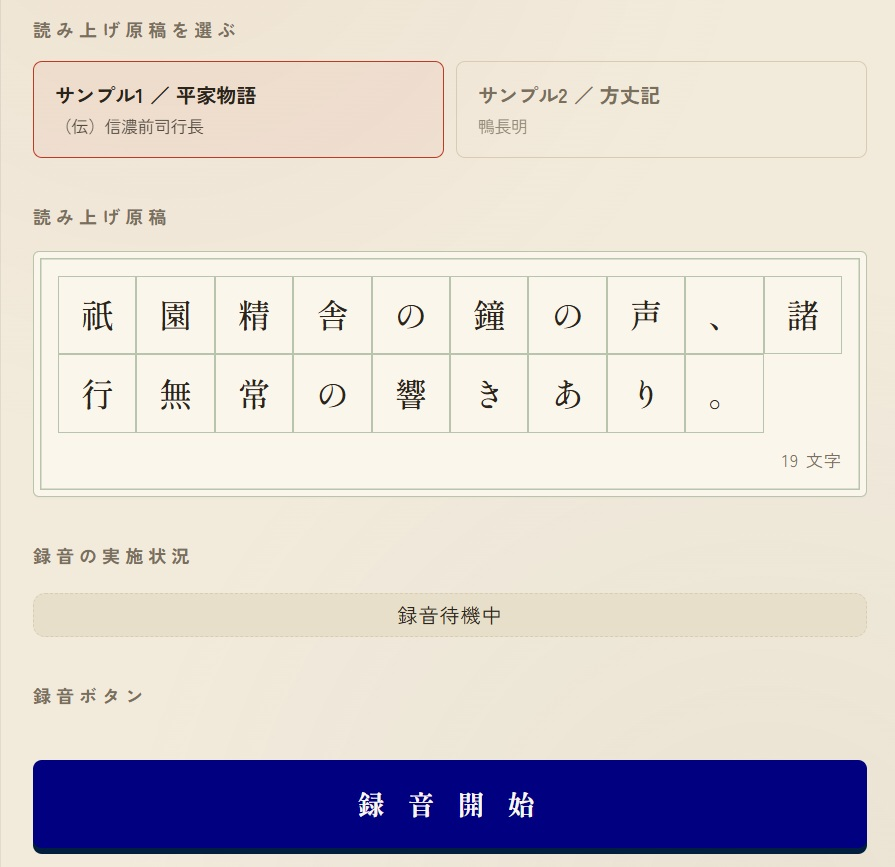
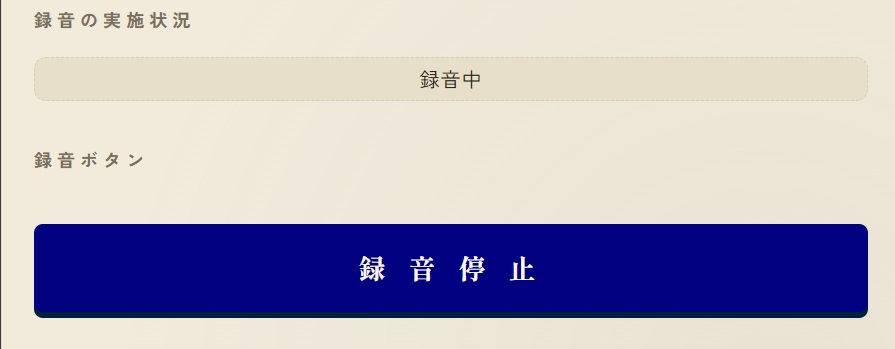
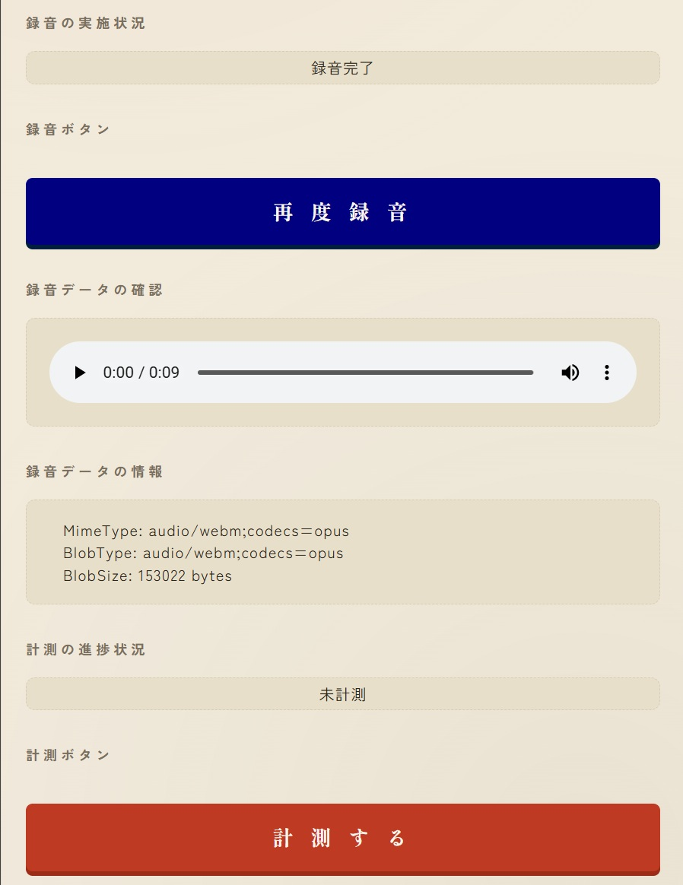
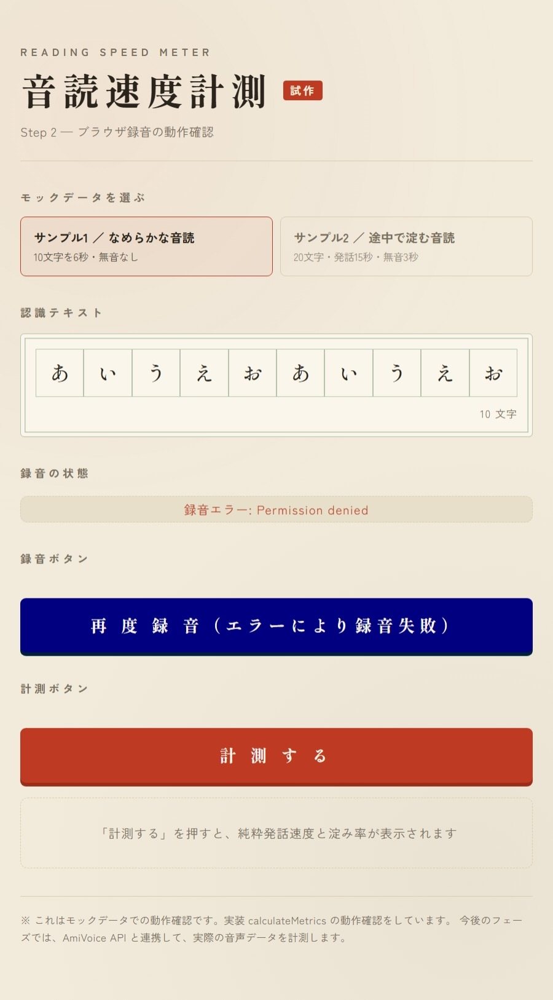
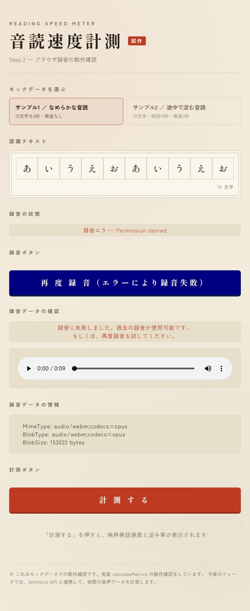

# Reading Speed Meter / 音読速度計測アプリ

日本語テキストを音読し、その速度・流暢性を計測・評価する Web アプリ。  
A web app that measures and evaluates the speed and fluency of Japanese read-aloud.

> 🏆 本プロジェクトは **Zennfes Spring 2026 / AmiVoice 協賛コンテスト** 応募作です。  
> This project is an entry for the **Zennfes Spring 2026 AmiVoice-sponsored contest**.

---

## 📸 Screenshots / 画面イメージ

### アプリ全体（Step 3 完了時点）/ App overview (Step 3)

原稿を選び音読を録音し、AmiVoice で音声認識した結果から純粋発話速度・淀み率を表示します。  
Pick a manuscript, record read-aloud, and view pure speaking speed and stagnation rate from AmiVoice recognition.



※ 上記キャプチャは Step 2 時点のもの。Step 3 では **録音 Blob → AmiVoice → 実データ計測** が追加されています。  
*Screenshot from Step 2; Step 3 adds **recorded Blob → AmiVoice → live metrics**.*

### モック原稿（Step 1）/ Mock manuscripts (Step 1)

原稿用紙に読み上げテキストを表示。Vitest で検証した指標ロジックの期待値確認に使った 2 パターン。  
Manuscript grid shows the text to read. Two presets used to validate metric logic in Vitest.

| サンプル / Sample | 条件 / Condition | 期待値 / Expected |
|---|---|---|
| サンプル1（なめらか） / Sample 1 (smooth) | 10 文字・6 秒・無音なし | 100 字/分・淀み率 0% |
| サンプル2（淀む） / Sample 2 (hesitant) | 20 文字・発話 15 秒・無音 3 秒 | 80 字/分・淀み率 16.7% |

<p align="center">
  
  
</p>

### ブラウザ録音（Step 2）/ Browser recording (Step 2)

マイクで音読を録音し、その場で再生・形式を確認（最大 10 秒）。  
Record via microphone, play back, and inspect format (max 10 seconds).

| 機能 / Feature | 説明 / Description |
|---|---|
| 録音開始・停止 / Start & stop | `useRecorder` + `MediaRecorder` + `getUserMedia` |
| 自動停止 / Auto-stop | 10 秒経過で録音終了 / Stops after 10 seconds |
| 再生確認 / Playback | `<audio controls>` で録音内容を確認 |
| 形式確認 / Format info | 選択 mimeType・Blob type・サイズを表示 |

#### 録音待機 / Idle



#### 録音中 / Recording



#### 録音完了 / Done



#### 録音エラー / Error

マイク拒否などで録音に失敗した状態。  
Recording failed (e.g. microphone permission denied).



#### 再録音失敗時のフォールバック / Re-record failure fallback

1 回目の録音は成功済み。2 回目が失敗しても **前回の録音を再生可能**。  
First recording succeeded; previous recording remains playable after a failed re-record.



### AmiVoice 連携・実データ計測（Step 3）/ AmiVoice & live metrics (Step 3)

| 機能 / Feature | 説明 / Description |
|---|---|
| BFF 中継 / BFF proxy | `POST /api/recognize` が API キーを保持し AmiVoice へ中継 |
| 音声形式 / Audio format | Chrome: `audio/webm;codecs=opus`（WebM + Opus、ヘッダあり） |
| マッパー / Mapper | 生 JSON → `AmiVoiceResponse` → `calculateMetrics` |
| 計測状態 / Measure status | 未計測 / 計測中 / 計測完了 / 計測エラー |

---

## 🚀 Getting Started / セットアップ

### 1. 依存関係 / Dependencies

```bash
npm install   # 初回のみ / first time only
```

### 2. 環境変数 / Environment variables

プロジェクトルートに `.env.local` を作成（Git には含めない）。  
Create `.env.local` at the project root (not committed to Git).

```env
AMIVOICE_API_KEY=your_amivoice_api_key
```

AmiVoice API キーは [AmiVoice Cloud Platform マイページ](https://docs.amivoice.com/) から取得。  
Obtain your AmiVoice API key from the [AmiVoice Cloud Platform console](https://docs.amivoice.com/).

> API キーは **サーバー側のみ**（`app/api/recognize/route.ts`）。ブラウザには絶対に出しません。  
> Keys stay **server-side only** (`app/api/recognize/route.ts`), never exposed to the browser.

### 3. 開発サーバー / Dev server

```bash
npm run dev   # → http://localhost:3000
npm test      # Vitest（15 tests）
npm run build # 本番ビルド確認 / production build check
```

### 動作確認の手順 / How to try it

1. `http://localhost:3000` を開く / Open in browser
2. **原稿を選ぶ** / Pick a manuscript tab（読み上げるテキスト / text to read aloud）
3. **録音** / Record: **録音開始** → 音読 → **録音停止**（または 10 秒待機 / or wait 10s）
4. 再生プレーヤーで録音を確認 / Confirm with the audio player
5. **計測する** を押す / Click **計測する** — 録音 Blob が AmiVoice へ送信され、指標が表示されます / sends the Blob to AmiVoice and shows metrics

> 録音にはマイク許可が必要です。HTTPS または `localhost` で動作します。  
> Recording requires microphone permission. Works on HTTPS or `localhost`.

### API Route 単体確認（任意）/ Optional API Route test

```bash
curl.exe -X POST http://localhost:3000/api/recognize -F "audio=@recording.webm"
```

---

## 📁 Project Structure / プロジェクト構成

```
reading-speed-meter/
├── app/
│   ├── api/recognize/route.ts      # AmiVoice BFF（同期 HTTP 中継）
│   ├── layout.tsx                  # 共通レイアウト / root layout
│   └── page.tsx                    # UI + 録音 + 実データ計測（Client Component）
├── lib/
│   ├── metrics/
│   │   ├── types.ts                # 型 + AnalysisPhase enum
│   │   ├── calculateMetrics.ts     # 指標算出の純粋関数
│   │   ├── calculateMetrics.test.ts
│   │   ├── mapAmiVoiceResponse.ts  # 生 JSON → AmiVoiceResponse
│   │   ├── mapAmiVoiceResponse.test.ts
│   │   └── mockData.ts             # 原稿用モックデータ
│   └── recorder/
│       ├── types.ts                # RecordingPhase enum
│       ├── constants.ts            # 録音時間・MIME 候補
│       ├── mimeType.ts             # mimeType 選択（純粋関数 + ラッパー）
│       ├── mimeType.test.ts
│       └── useRecorder.ts          # 録音カスタムフック
├── fixtures/                       # AmiVoice レスポンス fixture（Vitest 用）
├── docs/screenshots/               # README 用キャプチャ
├── LEARNING_LOG_Phase1_Step1.md
├── LEARNING_LOG_Phase1_Step2.md
├── LEARNING_LOG_Phase1_Step3.md
└── README.md
```

---

## 🤖 Development Style / 開発スタイル

締切があるため、**AI 協業開発** を採用しています（透明に開示）。  
Due to the deadline, this project uses **AI collaborative development** (disclosed openly).

| 日本語 | English |
|---|---|
| 設計・技術選定・仕様の判断は自分 | Design, tech selection, and spec decisions are mine |
| AI の提案を取捨選択・検証・修正したのは自分 | I select, verify, and revise AI suggestions |
| コードの動作を理解している | I understand how the code works |

| フェーズ / Phase | 進め方 / Approach |
|---|---|
| Step 1 | ヒント中心。コードは自分で書き、AI はレビュー役 |
| Step 2 以降 | 定型（MediaRecorder、fetch、API Route 骨子）は AI が例示 + 1 行解説。概念の核（状態設計・データフロー）は自分で実装 |

詳細な振り返り / Detailed logs:

- [`LEARNING_LOG_Phase1_Step1.md`](./LEARNING_LOG_Phase1_Step1.md) — 純粋関数・Vitest・モック UI
- [`LEARNING_LOG_Phase1_Step2.md`](./LEARNING_LOG_Phase1_Step2.md) — ブラウザ録音（MediaRecorder）
- [`LEARNING_LOG_Phase1_Step3.md`](./LEARNING_LOG_Phase1_Step3.md) — AmiVoice 連携・BFF・マッパー・実データ計測

---

## 🛠 Tech Stack / 技術構成

| レイヤー / Layer | 採用技術 / Technology | 備考 / Notes |
| :--- | :--- | :--- |
| フレームワーク / Framework | Next.js 16 (App Router) | API Routes（BFF）実装済み |
| 言語 / Language | TypeScript | |
| ブラウザ録音 / Recording | MediaRecorder API | `lib/recorder/useRecorder` |
| 音声認識 / Speech-to-Text | AmiVoice API（同期 HTTP） | `POST /api/recognize` 経由 |
| AI フィードバック / AI Feedback | Claude API (Haiku) | 未実装 / not yet |
| テスト / Testing | Vitest | `npm test`（15 tests） |
| デプロイ / Deploy | Vercel | 未実装 / not yet |

---

## 🏗 Architecture / アーキテクチャ

AmiVoice / Claude の API キーは **絶対にブラウザに出さない**。Next.js API Routes が BFF（中継）を担う。  
API keys for AmiVoice / Claude are **never exposed to the browser**. Next.js API Routes act as a BFF proxy.

```
[ブラウザ Browser]
  ├─ 原稿表示: mockData（読み上げテキスト）
  │   Manuscript: mockData presets
  ├─ 録音: getUserMedia → MediaRecorder → Blob → 再生確認
  │   Recording: getUserMedia → MediaRecorder → Blob → playback
  └─ 計測: FormData(audio) → POST /api/recognize
           ↓
[API Routes / BFF]  u + d + a → AmiVoice 同期 HTTP → 生 JSON
           ↓
[ブラウザ Browser]
  mapAmiVoiceResponse → calculateMetrics → 指標表示
  Mapper → pure metrics function → display
```

### AmiVoice 中継の要点 / AmiVoice proxy essentials

| 項目 / Item | 内容 / Detail |
|---|---|
| エンドポイント / Endpoint | `https://acp-api.amivoice.com/v1/nolog/recognize` |
| 認証 / Auth | multipart `u` = API キー（`Authorization` ヘッダではない） |
| エンジン / Engine | `d` = `-a-general`（会話_汎用） |
| 音声 / Audio | `a` = webm Blob（**multipart の最終パート**） |
| WebM + Opus | ヘッダあり → `c` パラメータ省略可 |

---

## ✅ Progress / 進捗

### Phase 1 — Step 1（完了 / Done）

評価指標の純粋関数・単体テスト・モック UI。  
Pure metric function, unit tests, and mock UI.

- [x] `segments` から指標を算出する **純粋関数**（`calculateMetrics.ts`）
- [x] **Vitest 単体テスト**（異常系・正常系・境界値）
- [x] モック原稿での **UI 動作確認**

### Phase 1 — Step 2（完了 / Done）

ブラウザでの音声録音（MediaRecorder）。  
Browser audio recording via MediaRecorder.

- [x] マイク許可・録音開始・停止（最大 10 秒）
- [x] 録音結果を **Blob** として取得・再生確認
- [x] 録音状態（待機 / 録音中 / 完了 / エラー）の管理・画面反映
- [x] mimeType フォールバック（`isTypeSupported`）と Blob 情報表示

### Phase 1 — Step 3（完了 / Done）

AmiVoice 連携と実データ計測。  
AmiVoice integration and live metrics.

- [x] 録音ロジックを `lib/recorder/` に分離（`useRecorder`）
- [x] **API Routes** 経由の AmiVoice 同期 HTTP 中継（BFF）
- [x] 生 JSON → `AmiVoiceResponse` **マッパー**（`mapAmiVoiceResponse`）+ Vitest
- [x] 録音 Blob → 認識 → `calculateMetrics` → 結果表示（mock → 実データ）
- [x] 計測状態（`AnalysisPhase`）の UI 表示

### Phase 1 — Step 4 以降（予定 / Planned）

- [ ] Claude Haiku で一言フィードバック生成
- [ ] Vercel デプロイ + 環境変数（`AMIVOICE_API_KEY` / `ANTHROPIC_API_KEY`）
- [ ] 認識テキストの画面表示・原稿との比較 UX

---

## 📐 Metrics Spec / 指標仕様

### 入力・出力 / Input & Output

```typescript
interface AmiVoiceSegment {
  starttime: number; // ミリ秒 / ms
  endtime: number;
}
interface AmiVoiceResponse {
  text: string;
  segments: AmiVoiceSegment[];
}

interface ReadingMetrics {
  pureSpeakingSpeed: number; // 純粋発話速度（文字/分）/ chars per minute
  stagnationRate: number;    // 淀み率（0〜1）/ stagnation ratio (0–1)
}

function calculateMetrics(response: AmiVoiceResponse): ReadingMetrics
```

### 算出ロジック / Calculation

| 指標 / Metric | 式 / Formula |
|---|---|
| 純粋発話時間 / pure speaking time | Σ(endtime − starttime) |
| 総経過時間 / total elapsed time | 最後の endtime − 最初の starttime |
| 純粋発話速度 / pure speaking speed | 文字数 ÷ 純粋発話時間(分)、`Math.round` |
| 淀み率 / stagnation rate | (総経過時間 − 純粋発話時間) ÷ 総経過時間、小数第 3 位 |

- **文字数 / character count:** 認識テキスト基準・コードポイント単位 `[...text].length`

### 異常系・境界値ガード / Guards

| 条件 / Condition | 戻り値 / Return |
|---|---|
| `segments` が空 / `text` が空 | `{ pureSpeakingSpeed: 0, stagnationRate: 0 }` |
| 純粋発話時間 0ms / 総経過時間 0ms | ゼロ除算を防ぎ 0 |

---

## ⚖️ Design Decisions / 仕様判断

### 指標（Step 1）/ Metrics (Step 1)

| 項目 / Topic | 決定内容 / Decision |
|---|---|
| 指標名 / metric name | `stagnationRate`（淀み率） |
| 文字数 / character count | 認識テキスト基準（コードポイント） |
| マッパー / mapper | 生 AmiVoice JSON → `AmiVoiceResponse` は純粋関数 1 枚 |

### 録音（Step 2）/ Recording (Step 2)

| 項目 / Topic | 決定内容 / Decision |
|---|---|
| 録音形式 / mimeType | `isTypeSupported` で候補を順に試す |
| 録音状態 / phase | Enum: 待機 / 録音中 / 完了 / エラー |
| 録音時間 / duration | 最大 10 秒 |
| 再録音失敗時 / re-record failure | 前回成功 Blob を温存 |

### AmiVoice・計測（Step 3）/ AmiVoice & measurement (Step 3)

| 項目 / Topic | 決定内容 / Decision |
|---|---|
| API キー / API key | `.env.local` → サーバー Route のみ |
| 中継形式 / proxy | 同期 HTTP、`u` / `d` / `a` multipart |
| segments 生成 / segments | S2: 各 token の start/end を segment に |
| 計測状態 / measure phase | M1: `AnalysisPhase` を録音と別 enum |
| 画面文言 / UI copy | ユーザー向けは「計測」。内部は `analysisPhase` |
| 原稿タブ / manuscript tabs | 読み上げテキスト表示用。計測データ源は録音 Blob |

---

## 🧪 Tests / テスト

`npm test` で **15 本**実行（すべて PASS）。録音・AmiVoice 連携はブラウザ / curl で手動確認。  
`npm test` runs **15 tests** (all PASS). Recording and AmiVoice flow are verified manually.

| ファイル / File | 本数 / Count | 内容 / Coverage |
|---|---|---|
| `calculateMetrics.test.ts` | 6 | 異常系・境界・正常系・無音あり |
| `mimeType.test.ts` | 7 | 純粋関数・フォールバック・ブラウザラッパー |
| `mapAmiVoiceResponse.test.ts` | 2 | curl 実データ fixture + 具体値 assert |

---

## 🖥 UI / 画面構成

和風 UI（Claude たたき台ベース）。計測ロジックは `lib/metrics/`、録音は `lib/recorder/useRecorder`。  
Japanese-style UI (Claude mockup base). Metrics in `lib/metrics/`; recording in `useRecorder`.

| 要素 / Element | 役割 / Role |
|---|---|
| 原稿タブ / manuscript tabs | 読み上げテキスト 2 パターンを選択 |
| 原稿用紙グリッド / manuscript grid | テキストを 1 文字ずつ表示 |
| 録音ボタン / record buttons | 開始・停止・再録音 |
| 録音状態 / recording status | 待機 / 録音中 / 完了 / エラー |
| 再生プレーヤー / audio player | 録音 Blob の再生確認 |
| 計測状態 / measure status | 未計測 / 計測中 / 計測完了 / 計測エラー |
| 計測する / measure button | 録音 Blob → AmiVoice → 指標算出 |
| 結果カード / result cards | 純粋発話速度・淀み率（%） |

---

## 🗺 Roadmap / ロードマップ

**Phase 1（積み上げ式 / incremental）**

1. ✅ 純粋関数 + Vitest + モック UI
2. ✅ ブラウザ録音（MediaRecorder）
3. ✅ API Routes 経由で AmiVoice 連携 + 実データ計測
4. Claude Haiku で一言フィードバック生成
5. Vercel デプロイ + 環境変数

**Phase 2 以降 / Later**

編集距離による正確性、テンポ安定性、抑揚（感情解析）、履歴表示、認識テキスト表示、UI 磨き込み。  
Accuracy via edit distance, tempo stability, prosody, history, recognized text display, UI polish.

---

## 🔗 Links / リンク

- リポジトリ / Repository: [github.com/uya0526-design/reading-speed-meter](https://github.com/uya0526-design/reading-speed-meter)
- AmiVoice API マニュアル / AmiVoice docs: [docs.amivoice.com](https://docs.amivoice.com/amivoice-api/manual/sync-http-interface)
